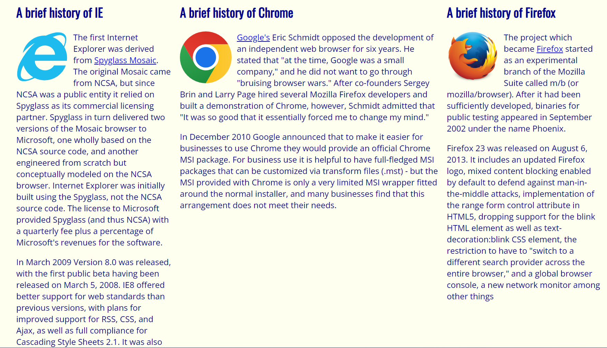

Having looked underneath the hood of the websites that we use in our daily lives, I can say for sure that what goes into producing these pages is a lot more complicated than what is on the surface. Between adding pictures, sectioning off elements, and creating navigation bars, I can only describe the process of making webpages as tedious. The road map that we took in my software engineering class to learn web development took us from raw html, to html and css, and finally, to using Bootstrap as a UI framework. When each new tool was introduced, I was able to see how it transformed the web development process to become more efficient and streamlined. At the same time, getting used to a new instrument each time came with its fair share of aches and pains. Reflecting back on this journey, Bootstrap is undoubtedly an extremely useful framework for developing user interfaces.

 

## Option Overflow

Once I started using CSS for my class assignments, things were starting to finally click in my head. I was able to look at a webpage and understand how certain parts were created and interacting with each other. The organization of styles that can cascade, following multiple layers of inheritance to control the layout, colors, and fonts, all coming together to form… the Mcdonald’s website? This was when I realized the amount of work and design theory that goes into creating a webpage, no matter how simple it may seem on the surface. Weirdly, as I browse through the internet now, I find myself pondering how the web designer applied a certain element in this way or used a transition to produce a certain effect. This then leads me to take a peek behind the curtains to see the html and style behind an element using Chrome developer tools. However, actually designing a webpage using CSS is a lot different than discovering how a website is built.

After my relatively short experience with trying to create web pages with CSS and html, I would describe the process as monotonous and tiresome. When first starting out, I quickly realized that although you can be as precise as you want with the layout of your website, it can quickly devolve into a rigid structure that offers no flexibility. In particular, while doing the Browser History assignment for my software engineering class, we were asked to create a webpage with three 300 pixel wide columns. For me, this resulted in the following layout:

  

After this, I recognized another problem that web designers had to tackle which was the issue of formatting the webpage to fit all the devices and screen sizes that are found in today's world.

## Buckling Down With Bootstrap

Although I was able to solve the problem above with just CSS, Bootstrap would have made it even more trivial. While learning how to use Bootstrap, my entire mindset on how to design a website shifted drastically. With only CSS, each element I was creating as its own fragment and piece of the entire website while loosely dividing the website up into chunks such as the top, middle, and bottom. With bootstrap, the boundaries are explicitly defined into a grid-like system using rows and columns. Not only that, everything can be placed into “containers” which allows one to clearly specify the margins and padding of various objects in that container. Furthermore, these containers can flex in order to always conform to the screen size of whatever device is accessing the webpage. Overall, it made the design process more fluid and eased the creation of common website elements like buttons, navigation bars, and dropdown menus.

Even though Bootstrap has definitely been useful, one area that I have had difficulty with is blending together CSS styles and Bootstrap utilities in order to get exactly what I want. One example of when I would have to rely more on CSS was when I was re-creating the Popeyes front page and I needed to model a button off of the following one:

  

Bootstrap does have predefined button classes, however, they are a lot less flexible with changing certain properties such as color, padding, and radius which can hurt a lot when trying to make a as close as possible replicate of another button. I found that it was much easier to create a button class of my own that models the original much better.

## Conclusion
---
Using Bootstrap and CSS together absolutely opens up a multitude of possibilities for creating various websites. Bootstrap provides efficient and flexible structure to the website while CSS allows me to attune the more specific aspects. I have to say, even though I appreciate what Bootstrap can do, when thinking of possible websites I would want to create in the future, I feel like having the freedom to create classes specifically tailored to my website would allow me the to follow the vision I have without any hindrances, even though it will take a lot longer. In the meantime, I think Bootstrap will give me good practice with design fundamentals that I can eventually transition into using other frameworks.