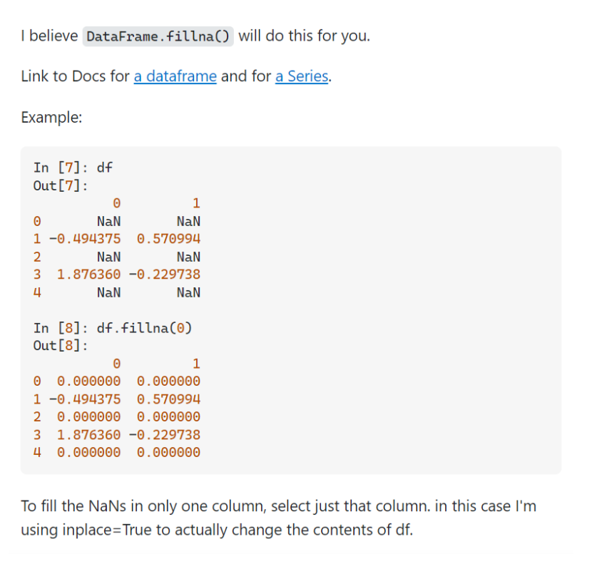
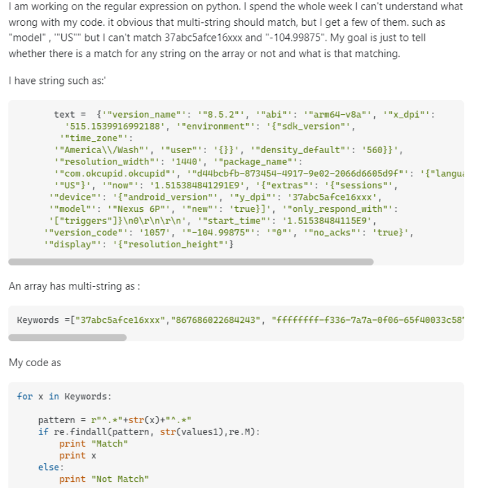

## A Fear of Questions

Have you ever been sitting in a class and as your professor is explaining a complicating concept, a feeling of confusion startes to creep into your mind? If you're like me, although this emotion is usually followed by a desire to reach out and inquire about the part that just doesn't make sense to me, my thoughts remains unspoken as the fear of asking a stupid question overtakes the confusion. 'I'll just look over the notes at home,' I think to myself. Sometimes, one of my classmates has the exact same question and I internally thank them as they face the potential ridicule for the both of us. Even Chat GPT, the artifical intelligence tool of the future, will provide an inaccurate solution if prompted incorrectly. Thankfully, I have learned of ways we can make our questions more thoughtful and effective so that the answers we recieve are just as insightful.

## Strategic Inquiry

One of the most popular forums for novice programmers is Stack Overflow. Throughout my various programming classes, I have encountered issues with my code and have referred to this site many times. From this site, I found the following question that reflects the style of a smart question. In particular, the user is asking how to replace NaN values to zeros in a pandas data frame.

Header: "How to replace NaN values by Zeroes in a column of a Pandas Dataframe?"

While there are a few ways he could have improved his question, this user followed many of the steps necessary to elicit responses. First, the subject header for the question is both clear and concise. When I found it, I knew right from the start that the user was having issues with a Pandas Dataframe which implicitly implies that he is coding in python. The specific issue that he is trying to solve is also outlined clearly in the header. Further along, he provides a model of the dataframe so that potential solvers can be sure that they are seeing the same things that the asker is seeing. In addition, the user provided the ways in which he attempted to replace NaN with zeros, including errors that appeared when utilizing various methods. This communicates the notion that he has put in the effort to solve the problem on his own and that he is willing to learn.

This question produced an equally exceptional answer:

 

This was only the top answer out of seventeen but the others provided were precise and void of any hostility from the people answering. The thread is very popular on the website with 630 upvotes for the question and 972 for the answer which displays how useful other people found it.

## Questionable Tactics

The next question is an example of one that does not effectively communicate the problem to Stack OverFlow users:

Header: "Array has multi strings against text with multiline ( regular expression) Python"

From the header alone, it is difficult to tell what the question is pertaining to. He at least specified that the language he was working in is Python. Other than that, the header would make it difficult to find this question on the web. Although he tries to communicate the goal of his code, this is not reflected in the answers he got. As seen above, one other user replied with “Your code’s goal is a bit confusing” and another user asked for some expected values of the code and referred the asker to a page about how to provide better context for debugging problems. In the replies to the users attempting to help him out, the asker adds more specifications that were not originally in the question which wastes the time of the people trying to figure out what the problem was.

## Conclusion

As programmers, it is almost guaranteed that we run into a problem with our code that we cannot solve ourselves. Collaboration is an essential part of surviving the software development landscape and facilitates quality assurance. As a student, knowing how to ask the “correct” questions will save you the anxiety of potential embarrassment. That is why, learning how to effectively relay a question to your peers and coworkers will serve as a vital skill in both school and the workplace.
