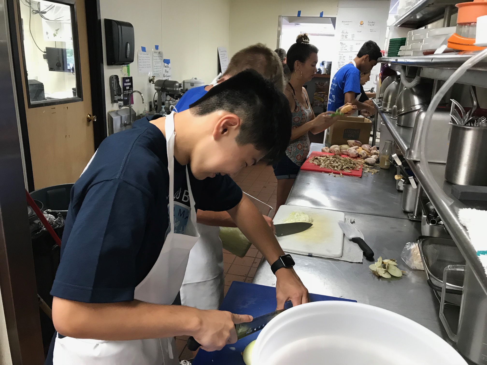

  

On May 4th, 2018, I was laying on a grass hill at the Hawaii Preparatory Academy, anxiously waiting for the track announcer to call up the participants for the 800m race. My pondering abruptly came to an end when the ground beneath me began to shake and shift violently. It had only lasted around five seconds and it was not enough to cancel the track meet but it happened to be a 6.9 magnitude earthquake that had followed up the opening of a fissure all the way across the island. This was the start to four months of erupting lava in Leilani estates that saw the destruction of over 700 homes.

It was over the summer that I was put in a position where I could make a difference. I was in the middle of my initiation for Key Club, the biggest service club on the Big Island, and I needed to chair my first project. I thought what better way to get involved than helping out those that were affected by the eruption. Through connections, I was able to get into contact with World Central Kitchen who was at the forefront of providing meals to the evacuees. I took five other club members down to Pahoa where we helped the organization with food prep, washing dishes, and learned about the process of providing food in response to community crises.

 Working for this organization was a wonderful experience for my first service project and it made me fall in love with helping out my community. As project chair, I also grew as a leader as I was responsible for everyone showing up to the right place and keeping everyone on task. Furthermore, I developed skills needed for community outreach and created a mindset where I am always looking for the next way to help out. Overall, this experience made me realize the importance of community service and how impactful it can be.
