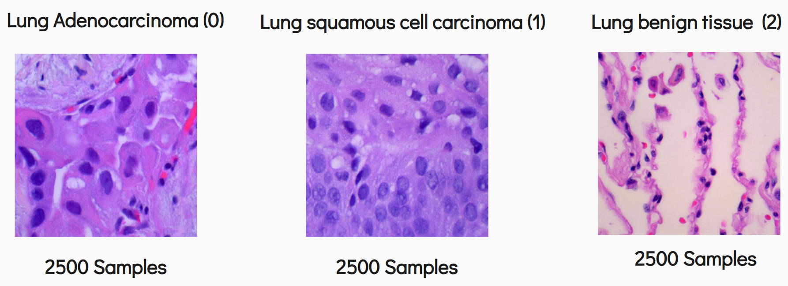

  

Cancer histopathology is a medical practice used to diagnose tumors using tissue samples. Deep learning techniques have been applied to this practice through the use of Convolutional Neural Networks to classify images of tissue samples.

Since CNNs have long been established as a tool for cancer histopathology, I wanted to do something a little different. Scikit-learn is a machine learning library that has a dedicated module for image processing called scikit-image. Using this module, one can extract features from images and generate a tabular dataset. However, it can be expected that some information loss will occur since essentially, the dimensionality of the data is reduced when converting from images to numerical features. If the performance is up to par, the extracted features can be used with models that are not as expensive as traditional CNNs.

To test this hypothesis, the images needed to be extracted from the original dataset, transformed into tabular data, and loaded into a tabular neural network. The results and write up can be found below.

[Link to Project Write Up](img/lung_cancer/lung_cancer_report.pdf)

[Link to Project GitHub Page](https://github.com/uhalpern/Lung_Cancer_Classification)