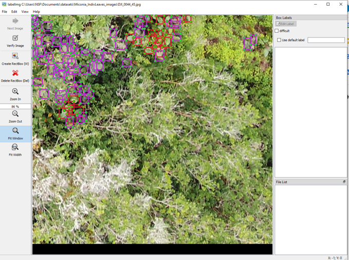

  

As machine learning is more readily used, a foreboding sense of apprehension towards the possibility of AI completely taking over every industry, fills news articles across the web. However, there is another side to this in which AI can be used to help humans with their jobs instead of outright replacing them. In my second semester of college, I was given the opportunity to work with my professor, Dr. Travis Mandel, on his area of study: Human-In-The-Loop Artificial Intelligence. In this field, AI is used to work effectively with humans so that better results can be achieved together rather than individually. 

For the project I was a part of, I worked on an annotator program that was used to identify clusters of invasive species from aerial photos of Big Island forests. The program utilized active learning, in which the user would provide the AI with a small portion of the dataset for training. In this case, the user would start outlining patches of invasive species on the pictures. Once the model is trained on enough samples, it will produce a prediction with its own outlines and ask the user to provide it with labels for these samples. This way, the human annotator will only have to label the most confusing samples that the model is not confident in.

Over the five months that I worked with my professor, I was tasked with fixing bugs, refactoring old code, and developing an evaluator for the model. The evaluator was used to analyze how the AI was improving the efficiency of annotating the pictures with the human scientist. Out of this data, I created two graphs to visualize the change in actions once the model reached a confidence threshold and to count up the total number of actions by the user on each image. This experience shaped my interests in computer science and firmly set my sight on pursuing data science. 
