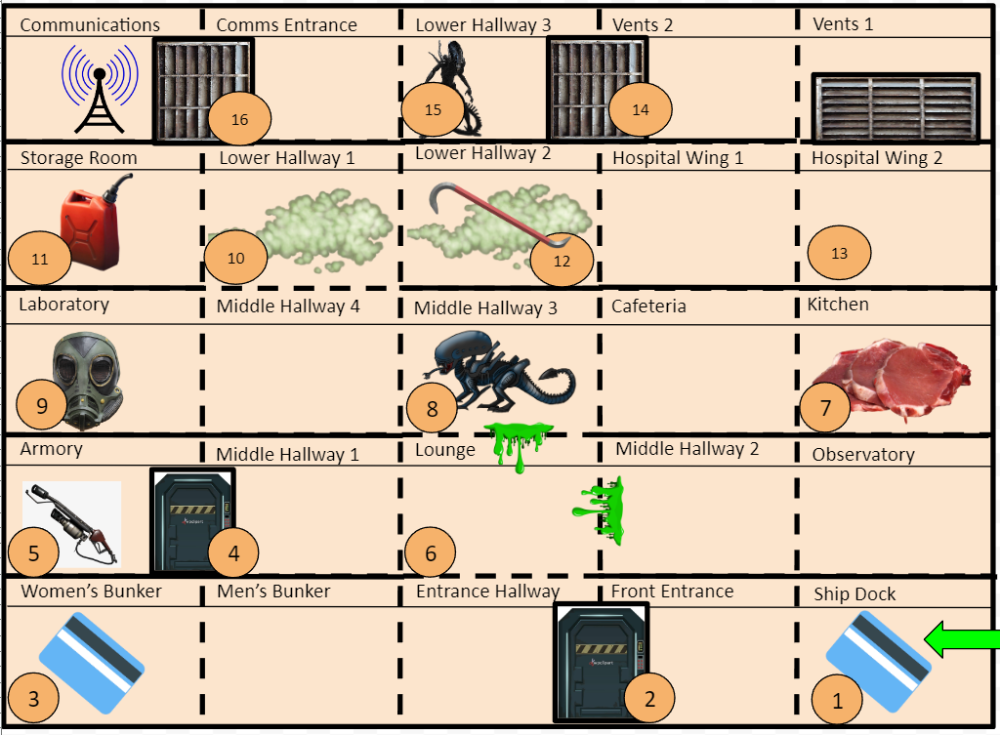

  

Making a text based adventure game is a great way to let your imagination run wild while keeping the scope of your project limited. You can make a text based adventure game with just your expertise of C++! No additional software is needed and you are allowed to tell any story you want. Even though you are restricted to what you can create with just text on a screen, this forces you to be even more creative with how you capture the attention of the people playing your game.

For my game, I wanted to create a sense of horror so that the player has something motivating them to finish. The player is tasked with making their way through an abandoned space station that is sending out a distress signal. As they explore more rooms, they must collect items to progress and slowly uncover what transpired before their arrival. When they finally uncover what lies in the final room, the player may be shocked to find what lies there waiting for them…

To create this project, I used basic C++ concepts introduced in an intro level class. The map of the space station was set on a five by five matrix, with each coordinate being a room. Each room is an object that has characteristics such as obstacles, items, voice logs, and boundaries. The player was also represented by a class to help manage inventory and keep track of the player's location. The hardest part was dealing with clearing the input stream efficiently and keeping track of the classes with inheritance. Overall, I learned how the basic concepts of C++ can come together to create a project that reflects my imagination.
